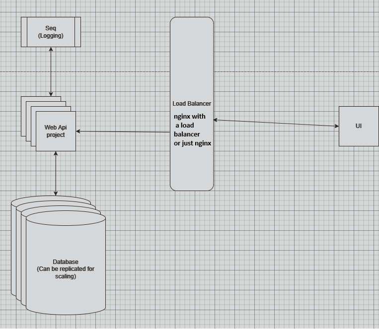

# _Commify Tax Calculator_

### Prerequisites:
1. .NET 8
2. Docker
3. Visual Studio 2022 (optional, but makes life easier)

---

## Running the Application

There are two main ways to run this app:

1. **Using Docker Compose Orchestration** (Recommended)
2. **Using Local Environment with Docker Containers or Local Instances**

---

### 1. Using Docker Compose (Recommended)
Turn on Docker Desktop.
In the root folder of the WebApi project, you will find a folder named **"Docker Production"**. This folder contains:
- **docker-compose.yml** file.
- Volumes for the database and Seq.
- Please run the command **docker-compose up** and the app is ready to be used.
**Note:**  
- You can delete the volumes if you want, but the database will automatically apply migrations when the containers are run.  
- For Seq, you will need to create an API token and save it as an environment variable for the API project if you remove the volumes.

---

### 2. Running Locally

To run the app locally, follow these steps:

1. Ensure the database instance are running on your local machine.
2. Set up the correct environment in the `appsettings` file (Dev, Test, Stage, or Prod).
3. Configure the connection strings for your app.

The database will contain the following table:

TaxBands

Id - Guid
BandName - Varchar(50)
LowerSalaryRange(int)
UpperSalaryRange(int)
TaxRate(int)
CreatedAt(timestamp with time zone - UTC)
LastUpdatedAt(timestamp with time zone - UTC)

#### Using the UI

- Open the UI folder from the root folder with Visual Studio Code.
- Install the Live Server extension
- Run the Live Server and be sure that it points to the correct port where the API points.
- Use the app.

#### Using Seq

- Seq is a tool that can be used with OpenTelemetry.
- You can find there organized logging, including the queries to the DB and more.

### Unit testing

- The Web API has unit tests, but only for the part that has actual logic. I didn't stayed to make 100% code coverage.

### Exception handling

- The WebApi presents exception handling. It has a middleware that catches any exception, logs it and sends a 500 Internal Server Error.
- The errors that can happen in the app and are treated are returned as a Bad Request using the ProblemDetails standard.
- The WebApi has the functionality to create a TaxBand. I didn't took the time to also make Update/Delete functionality(in the pdf it was not stated that I should also treat the create/update/delete of the TaxBands at all)
- The UI saves in the console the error if there is any

### Technologies used
 - ASP .NET 8
 - Docker & Docker Compose
 - PostgreSQL
 - Seq - OpenTelemetry
 
 ### Nuget packages used
 - ErrorOr(Result pattern implementation)
 - Npgsql - Postgres
 - Seq - OpenTelemetry
 - xUnit
 - Moq
 - FluentValidation
 
### Postman
- You have a postman collection to use in the root folder of the repository.
- You have 2 endpoints, one for calculating the tax and another to create a Taxband.
**Note:**  
- I didn't stayed to make tests in Postman.

### Scaling the app

- Below you can find an image for scaling the app
- This is how I envision it, but I don't think the app needs to be scaled since it is a very simple app that won't have a lot of users in my view.

Thank you and hope to get in the next stage.